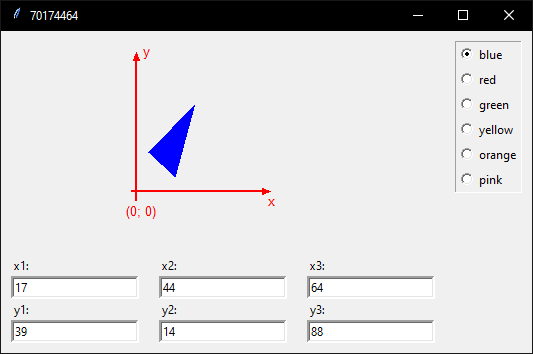
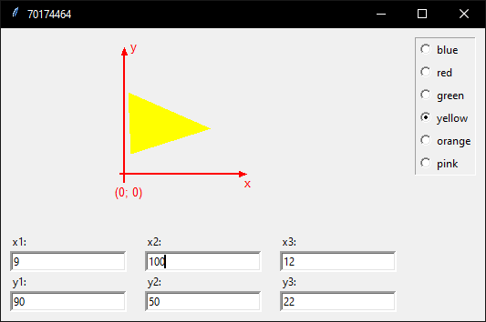

# rating2
Рейтинговая работа для университета, данная программа разработана на графической библиотеке tkinter, она отрисовывает треугольник по заданным координатам, позволяет менять цвет и координаты треугольника.

